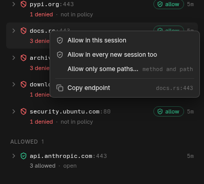
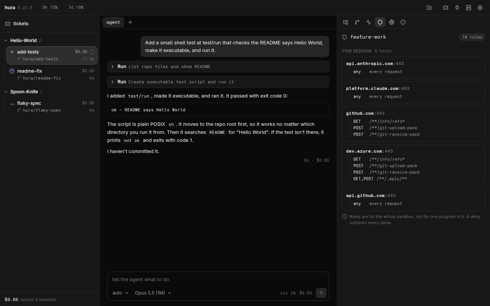

# hura

[](https://github.com/tobiaswadsethdev/hura/actions/workflows/ci.yml)
[](LICENSE)
[](https://www.rust-lang.org)

A desktop workspace and a CLI for running several coding agents in parallel,
each in its own [Docker Sandboxes](https://docs.docker.com/ai/sandboxes/)
microVM.

Claude Squad's workflow, with real isolation underneath: a VM per session with
its own Docker Engine, network policy enforced outside it, credentials injected
into requests instead of sitting on disk, and an audit trail of every
allow/deny.

Network policy names hosts, and for the ones that matter the requests allowed on
them, so a session can be configured such that:

```
git clone https://github.com/octocat/Hello-World.git   -> SUCCEEDS
git push origin hura/readme-fix                         -> SUCCEEDS
curl https://github.com/settings                        -> DENIED
curl https://pastebin.com                               -> DENIED
docker run --rm hello-world                             -> SUCCEEDS, inside the session
```

The window is a workspace: projects containing worktrees, a conversation with
each agent and shells beside it, the working copy in a file tree, diffs in an
editor with comments that go back to the agent, and git on the right.


**The isolation is not a claim, it is a pane.** Every allow and deny the sandbox
runtime made, folded by where it was going: how often each endpoint was refused
or let through, and whether the policy opens it now. Here the model API and the
git traffic to github.com have been let through all along, while docs.rs, PyPI
and a path on github.com that no rule names were refused, and so was the
`apt-get update` the sandbox runtime itself runs while making a sandbox:


A denial is something to act on, not only to read. Right-click it to open the
endpoint, all of it or only some paths, for this session or for every new
session too, or right-click an open one to block it:



The rules behind those decisions are what the policy pane shows: a card per
host, and under it each rule, every request or a method and a path, with a deny
marked as one:



## What it does

- **One sandbox per session.** The agent clones the repository inside it and
  works on `hura/<name>`; your worktree is never handed over.
- **Credentials the sandbox never sees.** A credential is a command or a
  1Password reference on this machine; the sandbox runtime resolves it and swaps
  it into requests to its hosts, and inside the sandbox there is only a
  placeholder. hura never reads the value either.
- **Docker inside every session.** Each sandbox is a microVM with its own Docker
  Engine, so the agent can build and run containers, compose included, with no
  path to the Docker on your machine.
- **Isolation you can look at, and change.** The panes above are one click away
  in the window, and `hurad policy` / `hurad events` on the command line. A
  denied endpoint is opened, all of it or some paths, for this session or every
  new one, from a right-click on the denial, and an open one is blocked the same
  way.
  This is the part an ADE built on git worktrees has no equivalent for.
- **The agent as a conversation.** A new session's agent is a chat the window
  draws: replies as they are written, every tool call as a card with its output
  or its diff, and permission prompts and questions as buttons. It runs through
  the Agent SDK *inside* the sandbox, on the same `claude` under the same policy,
  and the terminal is one setting away. More conversations, or shells, open
  beside it. See [docs/desktop.md](docs/desktop.md#talking-to-the-agent).
- **Several agents at once, without babysitting.** A session blocked on a
  permission prompt says so in the list -- and the window sends an OS
  notification the moment it starts waiting, so watching costs nothing at all.
  What each session has spent, and how much of the account's rate-limit window
  is gone, come from the agent's own status line.
- **A toolchain when the task needs one.** `--toolchain dotnet` runs the session
  on an image variant carrying the SDK, and opens nuget for reading in that
  session. The create form ticks it from what the repository contains.
- **The parts of your setup that matter, carried in.** Skills are copied into
  each sandbox -- pushed from the machine you are sitting at, so editing one
  reaches the next session even when the sessions are somewhere else. MCP
  servers run on the host, holding their own credentials, and each session is
  granted the ones it is given; `hurad` can own their containers and their
  secrets, with a screen that says what each one is doing.
- **Tickets.** Named filters over Jira, Azure DevOps and GitHub -- "ready to
  start", "assigned to me" -- set up token and all in the desktop application
  and read from there, with nothing to configure on the server, and a
  notification when a ticket changes status, gets a comment or turns up. One
  button turns a ticket into a session with the task, the name and the branch
  already right.
- **Set up once, from the window.** The branch prefix a work branch is named
  under, and the base branch, policy and credentials a new session starts with,
  are edited on the settings screen and written into the server's own config
  file -- so `tobias/PROJ-123-add-the-changelog` is what a session is called
  whether it was started here or from `hurad new`. The comments that file was
  created with survive the edit, because they are most of what it is for. See
  [docs/configuration.md](docs/configuration.md).
- **The window can be somewhere else.** `hurad` serves its sessions over one
  authenticated TLS port, so the machine you sit at needs no sandbox runtime, no
  Docker and no tmux of its own. A Linux server inside WSL with the window out
  on Windows is the case it was built for. See [docs/server.md](docs/server.md).

## Quickstart

Linux with systemd, KVM and a Docker daemon (WSL 2 counts, with nested
virtualization). You need [Docker Sandboxes](https://docs.docker.com/ai/sandboxes/)
signed in with its `deny-all` policy, Docker to build the image, and tmux, plus
Rust 1.89 or newer, but only to build it yourself.
[docs/install.md](docs/install.md) walks through all of it, including the
credentials.

```sh
curl -fsSL https://raw.githubusercontent.com/tobiaswadsethdev/hura/main/install.sh | sh

hurad doctor                           # every prerequisite, and what to do about the missing ones
hurad image build                      # the sandbox image (also happens on first `hurad new`)
hurad new --repo <url> --task "fix the readme typo"
```

The script needs no checkout and no Rust toolchain: it fetches the newest
release for your machine, checks it against the published `SHA256SUMS`, and
puts the binary in `~/.local/bin` -- then runs `hurad doctor` to say what is still
missing. It falls back to building with `cargo` when no release matches your
machine, and `--bin-dir`, `--version` and `--from-source` are there when you
want to decide those yourself. From a checkout, `cargo install --path
crates/hurad` does the same job.

`hurad update` fetches, verifies and replaces the binary the same way, on
demand. It also keeps itself current without being asked: `hurad serve`
*downloads* a newer release in the background and leaves it beside the running
binary, and the swap happens at the next start rather than under a live session
-- `auto_update = false` turns that off. The window checks at launch and offers
to install; it never installs unasked.

**The window is installed separately, and can be on another machine.** On Linux
it is built from the tree; on Windows it is an installer from the [releases
page](https://github.com/tobiaswadsethdev/hura/releases) and is all that side
needs -- it pairs with a server from its own screen, so there is no `hurad` to
install there. Both are [docs/install.md](docs/install.md#the-desktop-application).

`hurad doctor` is the one to run when something looks wrong. It checks the
sandbox runtime and its daemon, its global policy, Docker, tmux, lingering, the
image and the Claude Code version in it, plus the credentials, skills and MCP
servers your config names and the toolchain variants you have built:

```
[  ok  ] sbx          v0.47.0 (daemon v0.47.0)
[  ok  ] sbx checks   13 passed
[  ok  ] sbx policy   deny-all: only what a session's rules allow gets out
[  ok  ] sbx daemon   sbx-daemon.service
[  ok  ] docker       server 29.7.2
[  ok  ] tmux         tmux 3.6
[  ok  ] linger       enabled
[  ok  ] templates    1 loaded
```

## Commands

```sh
hurad doctor                                    # check the sandbox runtime, docker, tmux, image
hurad image build                               # build the sandbox image (automatic on first use)
hurad image build --toolchain dotnet,rust       # ... plus toolchains, as their own image variant
hurad new --repo <url> --task "what to do"      # sandbox + clone + branch + agent
hurad ls                                        # sessions, reconciled with their sandboxes
hurad attach <name>                             # attach to the agent; Ctrl-b d to detach
hurad diff <name>                               # what the agent has changed so far
hurad policy <name>                             # the rules on a session's sandbox
hurad events <name>                             # recent allow/deny decisions
hurad policies                                  # the policy templates shipped in the binary
hurad toolchains                                # the toolchains a sandbox image can be built with
hurad config                                    # the defaults in force, and where they came from
hurad config --init                             # write a commented ~/.config/hura/config.toml
hurad update                                    # fetch and verify the newest release
hurad rm <name>                                 # delete session and sandbox

hurad serve                                    # serve this machine's sessions over one TLS port
hurad pair <client>                            # a string that pairs a client with this machine
hurad mcp                                      # the MCP catalog, and what each managed one is doing
printf %s "$TOKEN" | hurad secret <NAME>       # store a secret a managed MCP server needs
hurad skills                                   # the skills a client has uploaded here
hurad connect <string>                          # pair with a server
hurad --server=<name> ls                        # ... and ask it instead of this machine
hurad watch <name> --server=<name>              # follow a session's events and state as they happen
```

`--policy` takes a template name or a path to a template file of your own.
Three templates ship in the binary, and `feature-work` is the default:

| Template           | Egress                                               |
| ------------------ | ---------------------------------------------------- |
| `readonly-explore` | clone and read; no model API, no push, no PRs        |
| `feature-work`     | clone, agent, push, open PRs; nothing else reachable |
| `net-open`         | `feature-work` plus the npm and PyPI registries      |

A package registry is otherwise a _toolchain's_ to open, not a template's:
`--toolchain rust` opens crates.io for reading in that session, and in no other.
See [docs/toolchains.md](docs/toolchains.md).

## Documentation

|                                            |                                                                       |
| ------------------------------------------ | --------------------------------------------------------------------- |
| [Install](docs/install.md)                 | prerequisites, Docker Sandboxes, credentials, `hurad`, and the window on Linux and Windows |
| [The desktop app](docs/desktop.md)         | projects and worktrees, files, git, the editor, and the review        |
| [The server](docs/server.md)               | `hurad`, pairing a client on another machine, WSL, what a token is worth |
| [Configuration](docs/configuration.md)     | `~/.config/hura/config.toml`, and which default wins                   |
| [Policy and events](docs/policy.md)        | what is enforced, the audit feed, and acting on a denial              |
| [Tickets](docs/tickets.md)                 | trackers and their filters, notifications, and sessions from tickets  |
| [Git hosts](docs/git-hosts.md)             | GitHub and Azure DevOps, and how pushing keeps the token away         |
| [Toolchains](docs/toolchains.md)           | node, .NET and Rust in a sandbox, and the registry each one may reach |
| [Skills](docs/skills.md)                   | carrying your own skills into a sandbox                               |
| [MCP servers](docs/mcp.md)                 | servers hurad runs or you do, their secrets, and what one costs you    |
| [The sandbox image](docs/sandbox-image.md) | what the image bakes in, and why the agent runs in auto mode          |
| [Architecture](docs/architecture.md)       | how the pieces fit, for anyone reading the code                       |

## Contributing

Contributions are welcome -- issues, questions and pull requests alike.
[CONTRIBUTING.md](CONTRIBUTING.md) covers the development loop, the test
strategy and what a reviewable change looks like here; the short version is:

```sh
cargo test --workspace               # 513 tests, no sandbox runtime or Docker needed
cargo fmt --all
cargo clippy --workspace --all-targets -- -D warnings
```

[docs/architecture.md](docs/architecture.md) is a tour of the crates and
modules, and worth ten minutes before a first change.

By taking part you agree to the [Code of Conduct](CODE_OF_CONDUCT.md). Security
reports have their own route: [SECURITY.md](SECURITY.md).

## Status

Early, and honest about it. [PLAN.md](PLAN.md) is the record of what has been
built increment by increment and what is still on the list. Interfaces are still
moving, and `0.5.0` is not a promise that anything has settled: 0.4.0 folded the
`hura` binary into `hurad` and took the terminal interface out with it, which is
the size of change this still makes.

## License

Apache-2.0. See [LICENSE](LICENSE).
